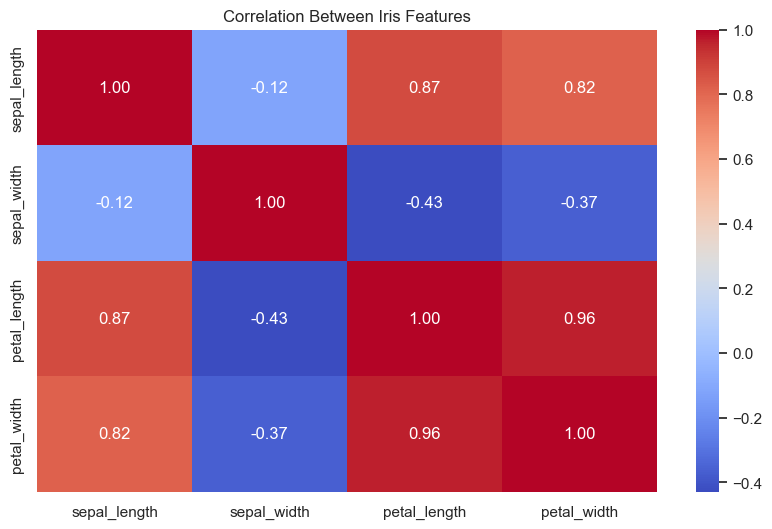
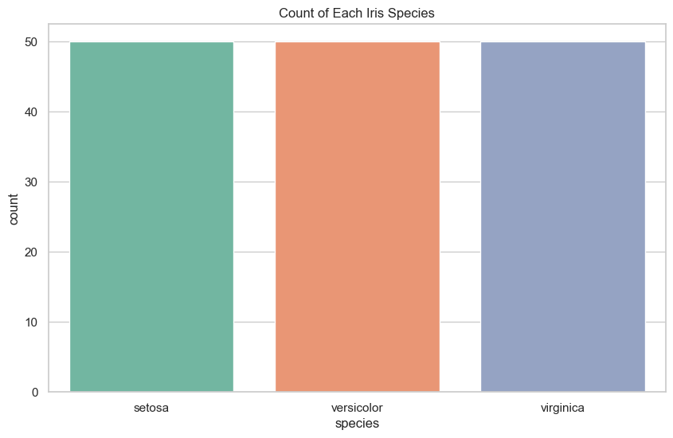
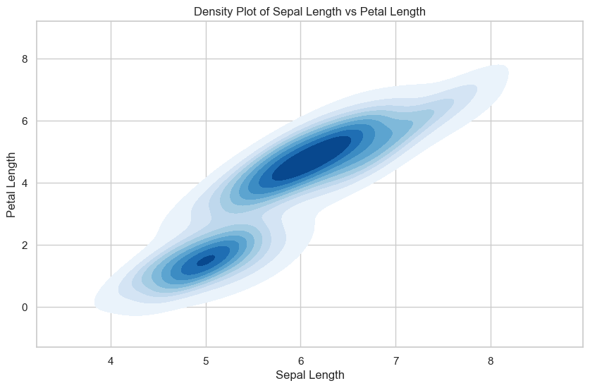
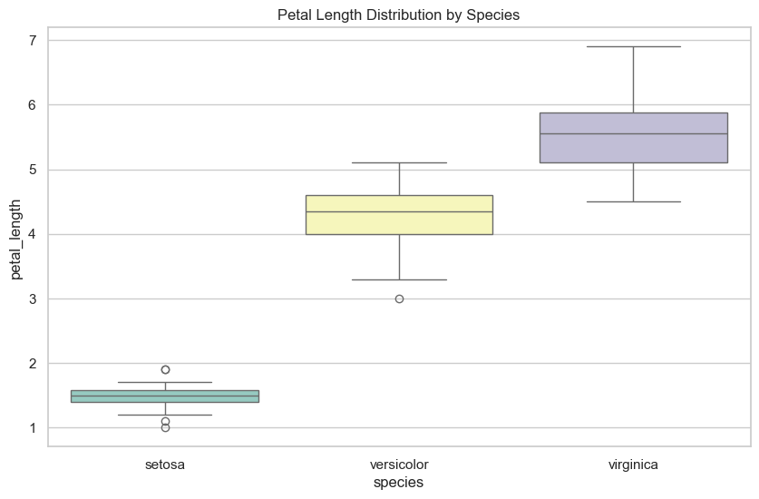
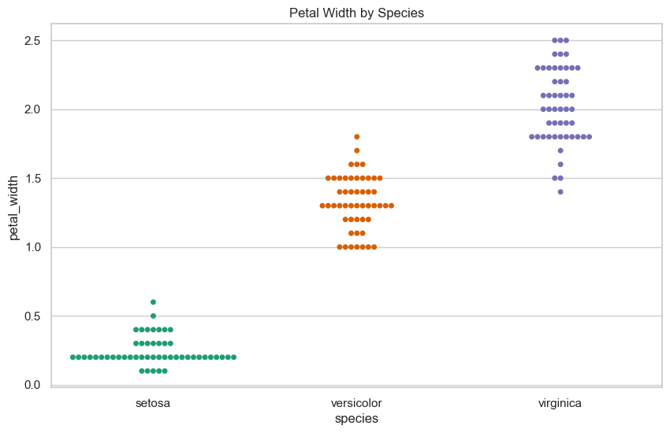
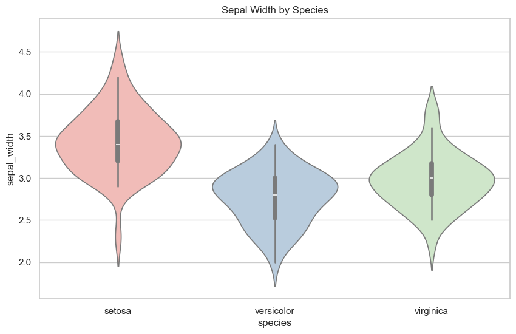

# Iris Visualization Repo

**Description**: Classic Iris dataset visualizations. Dataset source: classic Iris (available on Kaggle as copies).

## Repo structure
```
iris-viz/
├─ visualize.ipynb
├─ iris.csv
├─ images/
│  ├─ Sepal_Width_by_Species.png
│  ├─ Petal_Width_by_Species.png
│  ├─ Petal_Length_Distribution_by_Species.png
│  ├─ Density_Plot_of_Sepal_Length_vs_Petal_Length.png
│  ├─ Count_of_Each_Iris_Species.png
│  ├─ Correlation_Between_Iris_Features.png
└─ README.md
```

## PLOTS

## Correlation_Between_Iris_Features



## Count_of_Each_Iris_Species



## Density_Plot_of_Sepal_Length_vs_Petal_Length



## Petal_Length_Distribution_by_Species



## Petal_Width_by_Specie



## Sepal_Width_by_Species




## Insights / Observations
- Petal length and petal width are highly correlated; they separate species strongly (especially setosa vs others).
- Sepal length and sepal width are less discriminative than petal measurements.
- PCA shows clear separation of *setosa* from the other two species along PC1; *versicolor* and *virginica* overlap but are partially separable.
- Clustered matrix shows some grouping of similar samples when features considered together.

## How to reproduce
1. Open `visualize.ipynb` in Jupyter and run all cells. The notebook contains matplotlib or seaborn plotting code.
2. The `iris.csv` file contains the data used.

